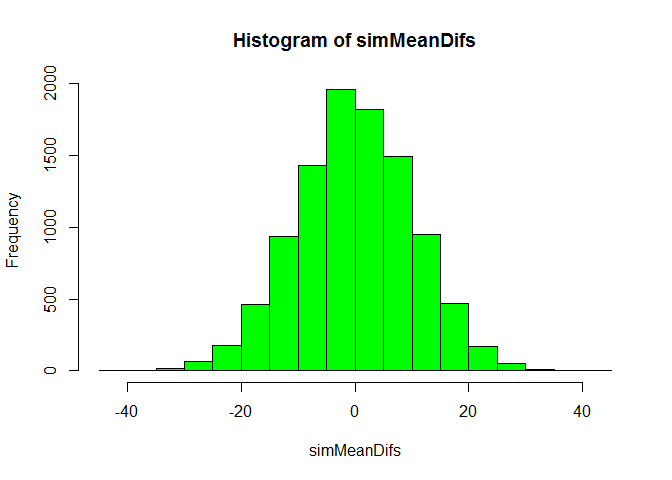
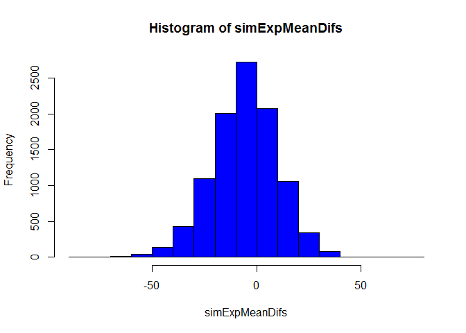
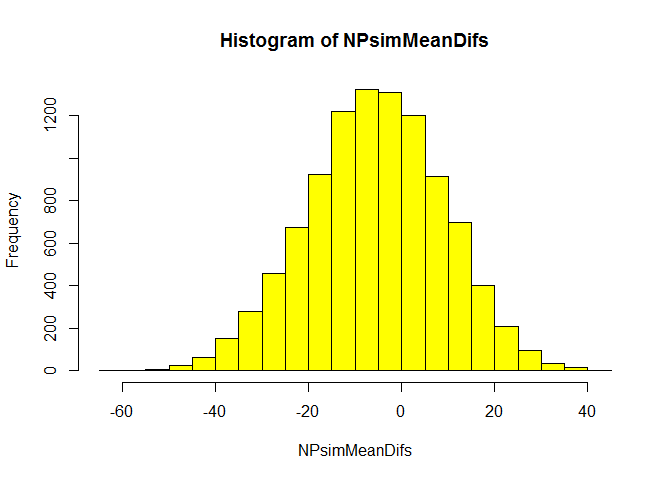

# Doing Data Science, HomeWork Week 4: Bootstrap Showing CLT
Najeeb Zaidi  
August 5, 2016  


# Introduction
In this presentation, we attempt to illustrate the Central Limit Theorem using the Bootstrap Method or Simulation Method on a sample data set.

We also describe the advantage of using this technique when compared to other methods .

This HTML uses DataCamp Interactive to display the R code used and is the improved version of plain text file presented earlier.

#### [Central Limit Theorem (CLT)](http://chem.libretexts.org/Under_Construction/Core_Construction/Math_Basics/Central_Limit_Theorem)

#### [Bootstrap / Simulation Method](https://en.wikipedia.org/wiki/Bootstrapping_(statistics))

#### [Resampling Simulation Methods](http://stats.stackexchange.com/questions/104040/resampling-simulation-methods-monte-carlo-bootstrapping-jackknifing-cross)


## Illustrations (Normal & Exponential Distributions vs Non Parametric)

### A. Parametric Bootstrap with function rnorm()
The first illustration below uses the Parametric Bootstrap for a normal distribution.
We use a random sample of x & y observations and define the number of simulations as well as set the seed to ensure results are replicated at a later stage:


```r
# Set hypothetical random sample 
x <- c(187, 169, 123, 166, 199, 127, 159, 155, 145, 142, 171)
y <- c(122, 45, 98, 38, 148, 179, 193, 54, 22, 245)

n1 <- length(x)
n2 <- length(y)

# Set number of Simulations 
k <- 10000

# define seed number such that the following computations can be replicated or reproduced
set.seed(1234)
```


```r
# Simulate or Bootstrap with replacement by repliocating from k samples of n1 & n2 normal 
# distributions with the right mean and variance 
# Also called the Parametric Bootstrap

simXsample <- replicate(k, rnorm(n1, mean(x), sd(x)))
simYsample <- replicate(k, rnorm(n2, mean(x), sd(x)))

# Compute mean differences of the n1 & n2 simulated observations k times

simMeanDifs <- apply(simXsample, 2, mean) - apply(simYsample, 2, mean)

# find the two relevant quantiles of k simulated mean differences
# i.e. 95% CI 
quantile(simMeanDifs, c(0.025 , 0.975))
```

```
##      2.5%     97.5% 
## -20.17093  19.68656
```
The Histogram plot of simulated mean differences looks like this:


```r
# Plot
hist(simMeanDifs, col = c("green"))
```

<!-- -->

### B. Parametric Bootstrap using an exponential function "rexp()"

In this case if we use rexp() function instead of rnorm that signifies that our the differences or any other function derived from x & y (eg. area) is non-linear, in which case the confidence interval could be computed with 3 different approaches:

     1) simulation / bootstrapped
     2) analytical
     3) theoretical derivations

these being computationally intensive , we use simulation here to illustrate CLT.

The most widely experienced case of exponential observations are those based on time. In this iluustration we use Call Center time durations recorded as random independent samples, whereby our dataset is small, has observations from two different days and we run a bootstrap (simulation) using the replicate function. We then comput the confidence interval for the mean differences simulated distribution  and plot a histogram to see if our distribution approaches a bell curve, i.e illustrates CLT. 

Call Center waiting times on 2 different days. We want to know if there is material difference in response time over these 2 sample days with small sample available. Also , for one of the days, fewer observations are available.


```r
# Define our dataset 
Day1Waiting <- c(23.6, 42.9, 53.4, 73.4, 1.6, 2.4, 13.6, 2.1)
Day2Waiting <- c(15.6, 34.5, 67.0, 89.0, 2.4, 1.8, 16.4)
Day3Waiting <- c(155.6, 347.5, 678.0, 893.0, 233.4, 134.8, 167.4)
         
L1 <- length(Day1Waiting)
L2 <- length(Day2Waiting)
L3 <- length(Day3Waiting)

# Setup for exponential function 
lambda1 <- 1 / mean(Day1Waiting)
lambda2 <- 1/ mean(Day2Waiting)

# Run the simulation / bootstrap
simXsample_exp <- replicate(k, rexp(L1, lambda1))
simYsample_exp <- replicate(k, rexp(L2, lambda2))

# Compute mean differences of n1 & n2 simulated observations k times:
simExpMeanDifs <- apply(simXsample_exp, 2, mean) - apply(simYsample_exp, 2, mean)

# find the two relevant quantiles of k simulated mean differences at 95% 
# 99% CI done just to see how much the result may differ
         
quantile(simExpMeanDifs, c(0.025,0.975))    # i.e. 95% Confidence Interval
```

```
##      2.5%     97.5% 
## -37.17591  23.48887
```

```r
quantile(simExpMeanDifs, c(0.005,0.995))    # i.e. 99% Confidence Interval
```

```
##      0.5%     99.5% 
## -50.13235  32.38471
```

```r
# Plot
hist(simExpMeanDifs, col = c("blue"))
```

<!-- -->

```r
# We can observe that our distribution is shifting away from mean = 0

hist(simExpMeanDifs, col = c("blue"), nclass = 250)
```

<!-- -->

```r
# A more dense plot of the same yields similar observation
```

### C. Non-Parametric Simulation for an Independent Sample with Replacement

In case of illustration A & B above, we made an assumption that the sample distributions are normal or exponential. This assumption can lead to interpretation errors, that can be costly in real world applications.

However, if we run a bootstrap on our sample directly, without assuming any parameter (i.e. non-parametric) but still assuming that sample observations are independent, then we create the simulated distribution with the replace function. In this case also, we find that the resulting mean distribution approaches CLT as depicted by the histogram in section:  


```r
# Non-parametric bootstrap on dataset used in illustration B
         
NPsimXsample <- replicate(k, sample(Day1Waiting, replace = TRUE))
NPsimYsample <- replicate(k, sample(Day2Waiting, replace = TRUE))
         
# Compute mean differences of n1 & n2 simulated observations k times:

NPsimMeanDifs <- apply(NPsimXsample, 2, mean) - apply(NPsimYsample, 2, mean)
         
# find the two relevant quantiles of k simulated mean differences
quantile(NPsimMeanDifs, c(0.025,0.975))    # i.e. 95% Confidence Interval
```

```
##      2.5%     97.5% 
## -35.09562  21.85335
```

```r
# Plot 
hist(NPsimMeanDifs, col = c("yellow"))
```

<!-- -->

#### A variation on Item C above to illustrate CLT

To further illustrate our point in section C above, we take observations from Day 3 cand compare them to Day 1 sample. Here I have kept the random obeservations between Day 1 and Day 3, visibly different to support the logic. The resulting hstigram supports our illustration of CLT in Sections A, B and C.


```r
# Variation on day3: 95% CI indicates that the 2 samples are very different;
# however we have shown here a bootstrap that does not assume any distribution
# or is non-parametric and the simulation with replacement is used to confirm 
# the mean difference
         
NPsimXsample <- replicate(k, sample(Day1Waiting, replace = TRUE))
NPsimYsample2 <- replicate(k, sample(Day3Waiting, replace = TRUE))
         
# Compute mean differences of n1 & n2 simulated observations k times:
         
NPsimMeanDifs1vs3 <- apply(NPsimXsample, 2, mean) - apply(NPsimYsample2, 2, mean)
         
# find the two relevant quantiles of k simulated mean differences
quantile(NPsimMeanDifs1vs3, c(0.025,0.975))    # i.e. 95% Confidence Interval
```

```
##      2.5%     97.5% 
## -571.5345 -161.2336
```

```r
#Plot
hist(NPsimMeanDifs1vs3, col = c("orange"))
```

<!-- -->


#### Notes:

1. I have used the replicate() function instead of employing "For loop"" to run my simulations as there are several examples of the later available on the web.

2. I have have gone a few steps further than the assignment requirements just to ensure that I could grasp the concept and application of bootstrap / simulations well enough.

3. To complete this assignment I have used several online and text references, and especially acknowledge materials from Prof. Per Bruun Brockhoff's podcat lectures at DTU. 


